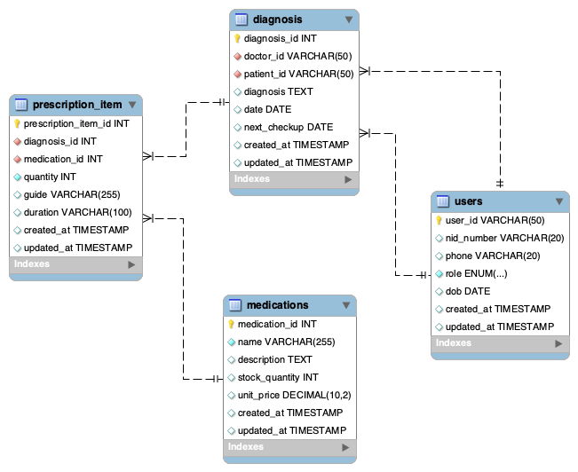

# 📌 Project Title: **MedCare**

## 📄 Brief Description:<br>

**MedCare** is an AI powered patient care system designed to remove the heavy admin work doctors usually rely on nurses for. Doctors speak naturally to record diagnoses, prescriptions, and treatment notes, and the system converts that voice input into structured data stored securely. Patients can log in to track their medications, check usage instructions, and receive updates, while doctors stay informed through real time summaries and alerts. MedCare creates a smoother, more efficient workflow for both patients and clinicians

## 🎯 Functional & Non-functional Requirements

### 1. Functional Requirements (FR)

#### A. For Doctors (Clinical Operations)

- **FR-01: AI-Assisted Consultation**

  - The system converts doctors’ voice input into text.
  - AI extracts structured clinical data (e.g., symptoms, diagnosis).
  - Doctors review and confirm AI-generated forms before saving data into the `diagnosis` table.

- **FR-02: Prescription Management**

  - Doctors can select medications from the medication catalog.
  - The system automatically checks `stock_quantity` before confirming prescriptions to prevent overselling.

- **FR-03: Medication Management**

  - Doctors can view Top 5 most prescribed medications and Top 5 lowest stock medications.
  - Doctors can add and update medications from the medication catalog.

- **FR-04: History Retrieval**

  - Doctors can view complete patient timelines, including consultations and diagnoses.
  - Records are sorted chronologically to support informed clinical decisions.

- **FR-05: Clinical Dashboard**
  - Displays daily operational statistics such as total patients treated.
  - Data is retrieved via aggregated database views.

#### B. For Patients (Personal Health Management)

- **FR-06: Medical Record Access**

  - Patients can view their consultation history and doctors’ notes.
  - Access is strictly read-only through the patient portal.

- **FR-07: Medication Tracking**
  - Patients can view active prescriptions along with dosage instructions.
  - Supports better medication adherence and self-monitoring.

---

### 2. Non-Functional Requirements (NFR)

- **NFR-01: Data Integrity**

  - Foreign Key constraints are enforced to prevent orphaned records.
  - Strict data types are used (e.g., `DECIMAL` for prices, `DATE` for date of birth) to ensure data accuracy.

- **NFR-02: Security**

  - Authentication is fully handled by **Clerk**.
  - The database does not store passwords.
  - Internal `user_id` values directly match external Clerk IDs, ensuring secure identity mapping without redundant fields.

- **NFR-03: Performance**

  - Patient records must be retrieved in under 2 seconds.
  - Indexes are applied to critical lookup columns

- **NFR-04: Scalability**
  - The database schema is normalized to **Third Normal Form (3NF)**.

## 🧱 Database Schema


**4 tables** (normalized to 3NF):

1. **users** - Base authentication (Clerk integration)
   - `user_id` (PK), `nid_number`, `phone`, `role` (Doctor/Patient), `dob`

2. **medications** - Medication catalog with inventory
   - `medication_id` (PK), `name`, `description`, `stock_quantity`, `unit_price`

3. **diagnosis** - Medical consultations
   - `diagnosis_id` (PK), `doctor_id` (FK), `patient_id` (FK), `diagnosis`, `date`, `next_checkup`

4. **prescription_item** - Prescribed medications (junction table)
   - `prescription_item_id` (PK), `diagnosis_id` (FK), `medication_id` (FK), `quantity`, `guide`, `duration`

**Database Objects**: 11 indexes | 6 views | 2 stored procedures | 3 triggers

> See [`docs/database.md`](docs/database.md) for complete schema documentation

## 🚀 Quick Start

### 1. Prerequisites

- MySQL 8.0+
- Node.js 18.0+
- pnpm (or npm/yarn)
- Clerk account ([clerk.com](https://clerk.com))

### 2. Database Setup

Follow the step-by-step guide in **[`sql/README.md`](sql/README.md)** to:
1. Create database
2. Create tables (users, medications, diagnosis, prescription_item)
3. Create indexes (11 performance indexes)
4. Create views, procedures, and triggers
5. Load sample data (optional)

### 3. Application Setup

```bash
# Install dependencies
pnpm install

# Configure environment variables
cp .env.example .env
# Edit .env with your database credentials (get from Railway deployment) and Clerk API keys (get from Clerk dashboard)

# Run development server
pnpm dev
```

Visit `http://localhost:3000`

### 4. Create Test Users

1. Sign up via the web application (creates user in Clerk)
2. Complete onboarding (fills in NID, phone, DOB, role)
3. Access role-specific dashboard

## 📚 Documentation

| Document | Description |
|----------|-------------|
| [`sql/README.md`](sql/README.md) | **Database setup guide** (step-by-step) |
| [`docs/database.md`](docs/database.md) | Schema documentation, normalization proof |

## 🛠️ Tech Stack

- **Frontend**: Next.js 16, React, TailwindCSS
- **Backend**: Next.js API Routes, MySQL2
- **Database**: MySQL 8.0
- **Deployment**: Vercel, Railway
- **Authentication**: Clerk
- **AI**: Google Gemini API

## 👥 Team Members and Roles

| Name                | Role                        |
| ------------------- | --------------------------- |
| Pham Quynh Trang    | Database + AI + Frontend    |
| Nguyen Thi Bao Tien | Database + API + Deployment |
| Ngo Thanh An        | Database + Backend          |

## 📅 Timeline (planned milestones)

| Week/Date                   | Activity/Phase                                              | Detailed Tasks                                                                                                                                                                                                                                                                                                                                                                       | Key Deliverable / Milestone                                                                                                 |
| --------------------------- | ----------------------------------------------------------- | ------------------------------------------------------------------------------------------------------------------------------------------------------------------------------------------------------------------------------------------------------------------------------------------------------------------------------------------------------------------------------------ | --------------------------------------------------------------------------------------------------------------------------- |
| **Week 1: Dec 1 - Dec 7**   | Phase 1: Database Design & Planning (Completed/In Progress) | - Review and finalize all functional and non-functional requirements<br>- Finalize ERD and 3NF schema design (Users, Doctors, Patients, Prescriptions, etc)<br>- Write initial DDL scripts for all 8 core tables (create tables, define primary and foreign keys, ENUM types)                                                                                                        | Milestone 1: Finalized ERD, full DDL scripts, completion of conceptual and logical design                                   |
| **Week 2: Dec 8 - Dec 14**  | Phase 2: Core DB Implementation and Logic                   | - Peer review (Due Dec 8)<br>- Implement all DDL in MySQL Workbench or CLI<br>- Implement 5 stored procedures (focus on sp_IssuePrescriptionItem with FOR UPDATE locking and ACID transaction logic)<br>- Implement 2 triggers (trg_Audit_StockUpdate, trg_Prevent_Prescription_Deletion)<br>- Load sample data into all tables                                                      | Milestone 2: All tables, procedures, and triggers implemented, physical implementation nearly complete                      |
| **Week 3: Dec 15 - Dec 21** | Phase 3: Security, Reporting and Frontend Integration       | - Submit design document (Due Dec 15)<br>- Implement 2 views (vw_MonthlyClinicStats, vw_PatientMyMeds)<br>- Apply indexing for performance tuning (patient_id, doctor_id, Medications.name)<br>- Build Next.js backend API to connect to MySQL and call stored procedures<br>- Implement authentication and RBAC for Admin, Doctor, and Patient roles                                | Milestone 3: Secure DB plus API integration ready, all views created, indexing complete, security configuration implemented |
| **Week 4: Dec 22 - Dec 28** | Phase 4: Finalization, Testing and Deployment               | - Final submission and presentation slide (Due Dec 22)<br>- Complete UI and UX for Doctor Dashboard, Patient Portal, Admin Reports<br>- Perform end-to-end testing: CRUD, sp_IssuePrescriptionItem, access control workflow<br>- Optimize queries to meet NFR-03 target under 2 seconds<br>- Prepare demo presentation and final documentation (PDF)<br>- Publish all code to GitHub | Milestone 4: Final functional website, full testing complete, final submission delivered and project ready for demo         |
